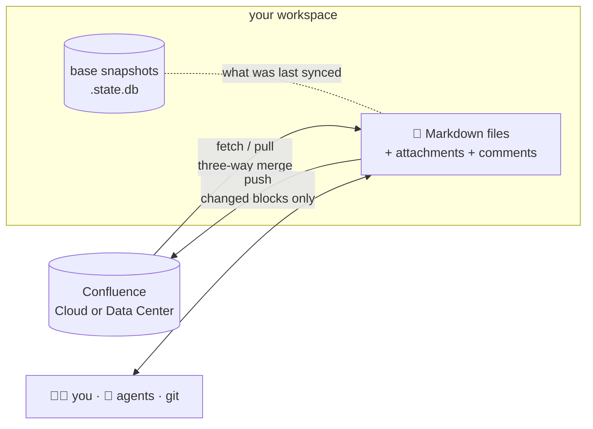

<div align="center">

# confed

**conf**luence **ed**itor — `confed`, as in `ed`, the original Unix editor

### Confluence, as Markdown files on your disk.

Edit pages in your editor, review them in git, sync them like git —
or hand the whole space to an AI agent.

[](https://github.com/hxmn/confed/actions/workflows/ci.yml)
[](https://github.com/hxmn/confed/blob/main/CHANGELOG.md)
[](#license)
[](https://www.rust-lang.org)
<br>
[](https://github.com/hxmn/confed/blob/main/docs/auth.md)
[](https://github.com/hxmn/confed/blob/main/docs/auth.md)
[](https://github.com/hxmn/confed/tree/main/docs/reference/json)
[](#-built-for-ai-agents)

[Quickstart](https://github.com/hxmn/confed/blob/main/docs/quickstart.md) ·
[Commands](https://github.com/hxmn/confed/blob/main/docs/commands.md) ·
[How sync works](https://github.com/hxmn/confed/blob/main/docs/sync.md) ·
[Changelog](https://github.com/hxmn/confed/blob/main/CHANGELOG.md)

</div>

---

```console
$ confed clone https://acme.atlassian.net/wiki/spaces/DOCS
Cloned 214 pages, 96 attachments and 41 comment threads into DOCS/

$ cd DOCS && $EDITOR "Team Handbook/Onboarding.md"

$ confed status
  modified  Team Handbook/Onboarding.md

$ confed push --dry-run          # exactly what would be uploaded — nothing is sent
$ confed push -m "Clarify the first-week checklist"
  pushed    Team Handbook/Onboarding.md  v7 → v8
```

## ✨ Why confed

Confluence's editor is fine for a paragraph. It is not where you want to restructure a
handbook, review a colleague's change, fix a term across forty pages, or let an agent
do any of that for you. confed puts the whole space on disk as Markdown — so your
editor, `grep`, `git` and your agent all just work — and keeps it in sync with the
server, safely.

| | |
|---|---|
| 🎯 **Your edits stay yours** | Only the blocks you change are regenerated. Everything else goes back byte-for-byte, so a one-word fix never reformats the page. |
| 🔀 **Merges like git** | Three snapshots per page — base, yours, theirs — give a real three-way merge with familiar conflict markers. No "last write wins". |
| 🛡️ **Refuses to lose work** | `pull` stops before clobbering local edits; `push` refuses stale versions, unresolved conflicts, and deletes you did not ask for. |
| 🧩 **Nothing is lost in translation** | Macros confed cannot model travel as readable ```` ```confluence ```` blocks and round-trip exactly. |
| 💬 **Comments in your text** | Open inline threads appear where they sit in the page; add one by wrapping a phrase. Reply, resolve, edit — from the terminal. |
| 🤖 **Built for agents** | JSON on every command, deterministic exit codes, no prompts without a terminal, and a generated `CLAUDE.md` / `AGENTS.md` contract in every workspace. |

## 🔄 How it works



`fetch` brings the server's state into a local database without touching your files.
`pull` writes it into them, merging against the base it last synced. `push` uploads
only what changed, carrying the page version so a colleague's newer edit is never
overwritten. Read [docs/sync.md](https://github.com/hxmn/confed/blob/main/docs/sync.md) for the whole model.

## 📋 What it covers

| | Cloud | Data Center |
|---|:---:|:---:|
| Pages: create, edit, move, reorder, rename, delete | ✅ | ✅ |
| Labels, attachments, page version history | ✅ | ✅ |
| Three-way merge and conflict resolution | ✅ | ✅ |
| Page comments: add, reply, edit, delete | ✅ | ✅ |
| Inline comments, shown in the page body | ✅ | ✅ |
| Inline comments: create, reply, resolve | ✅ | ✅ ¹ |
| Mentions and page links in Markdown | ✅ | ✅ |
| CQL search, recent activity, open in browser | ✅ | ✅ |
| HTML export and an MkDocs site over the space | ✅ | ✅ |
| Interactive terminal UI | ✅ | ✅ |

¹ Through the inline-comment API the Data Center page view itself uses, which Atlassian
does not document; tested on 9.x.

## 🤖 Built for AI agents

confed was designed to be driven by coding agents as much as by people.

- **Every command speaks JSON.** `--json` gives a versioned envelope with `result`,
  `errors` and `warnings`; schemas live in [docs/reference/json](https://github.com/hxmn/confed/tree/main/docs/reference/json).
- **Exit codes mean something.** `4` is "pull first", `6` "not found", `7` "local state
  needs attention", `9` "this server cannot do that" — never a bare `1`.
- **It never hangs.** Without a terminal confed never prompts: a missing value fails
  at once, naming the flag and the environment variable to set.
- **The workspace explains itself.** `confed init` writes `CLAUDE.md` and `AGENTS.md`:
  the frontmatter contract, what is safe to edit, the conflict workflow, how comments
  work. They are stamped with the confed that wrote them, every command warns when they
  are stale, and `confed version --changelog --since <version>` tells an agent exactly
  what changed after an upgrade.
- **Your rules, kept in Confluence.** `confed config --set rules_page_id <page>` copies
  a page of the space to the top of both files, so Claude Code and Codex start every
  session with the team's own rules — and get the new ones when the page changes.
- **Dry runs show everything.** `push --dry-run --show-storage` prints the exact
  Confluence markup each page and comment would be sent as.

```console
$ confed status --json
{
  "confed": { "schema": 1, "version": "0.8.1", "command": "status", "ok": true, "exit_code": 0 },
  "result": {
    "clean": false,
    "pages": [
      { "path": "Team Handbook/Onboarding.md", "state": "modified", "comment_drafts": 1 }
    ]
  },
  "errors": [],
  "warnings": []
}
```

## 🚀 Install

```bash
cargo install --git https://github.com/hxmn/confed confed
```

Requires Rust 1.85 or newer — no system dependencies: TLS, SQLite and the OS keyring
integration are vendored or pure Rust. Then:

```bash
confed clone https://your-site.atlassian.net/wiki/spaces/KEY   # Cloud: email + API token
confed clone https://wiki.example.com --space KEY              # Data Center: personal access token
```

[docs/quickstart.md](https://github.com/hxmn/confed/blob/main/docs/quickstart.md) walks through the first sync in five minutes,
and [docs/auth.md](https://github.com/hxmn/confed/blob/main/docs/auth.md) covers tokens and where secrets are kept (the OS
keyring, or a `0600` file).

## 🧰 Commands

| Sync | Authoring | Discussion | Explore | Workspace |
|---|---|---|---|---|
| `clone` · `fetch` · `pull` · `push` · `status` · `diff` · `resolve` | `new` · `mv` · `rm` · `attach` | `comment list · add · reply · resolve · edit · rm` · `user search` | `log` · `search` · `open` · `spaces` · `export` · `mkdocs` · `tui` | `init` · `config` · `doctor` · `whoami` · `version` · `completion` |

Every command, flag and exit code is in [docs/commands.md](https://github.com/hxmn/confed/blob/main/docs/commands.md).

## 📁 Layout on disk

```
DOCS/
├── Team Handbook.md            a page
├── Team Handbook/              its child pages
│   ├── Onboarding.md
│   └── .Onboarding/            attachments, comments.md and storage.xml for Onboarding.md
├── CLAUDE.md · AGENTS.md       generated agent contract
├── .state.db                   sync state (git-ignored)
└── .session.db                 credentials, mode 0600 (git-ignored)
```

Each page carries YAML frontmatter. `title`, `labels` and `parent_id` are yours to edit
and sync on push; everything under `confed:` is tool-managed, and push refuses a page
whose managed block was hand-edited. Details in [docs/format.md](https://github.com/hxmn/confed/blob/main/docs/format.md).

## 📚 Documentation

- [Quickstart](https://github.com/hxmn/confed/blob/main/docs/quickstart.md) — first sync in five minutes
- [Authentication](https://github.com/hxmn/confed/blob/main/docs/auth.md) — API tokens, PATs, and where secrets are kept
- [Commands](https://github.com/hxmn/confed/blob/main/docs/commands.md) — every command, flag and exit code
- [File format](https://github.com/hxmn/confed/blob/main/docs/format.md) — frontmatter, layout, preserved macros, comment marks
- [Sync model](https://github.com/hxmn/confed/blob/main/docs/sync.md) — fetch, pull, push and the conflict workflow
- [Troubleshooting](https://github.com/hxmn/confed/blob/main/docs/troubleshooting.md) — symptoms, causes, fixes

Design documents live in [docs/design](https://github.com/hxmn/confed/blob/main/docs/design/01-architecture.md), and the
implementation plan in [docs/plan](https://github.com/hxmn/confed/blob/main/docs/plan/README.md).

## 🛠️ Development

```bash
make            # list the available tasks
make test       # unit, wiremock and scenario tests
make ci         # everything the CI pipeline runs — green here means green there
```

Eight crates, dependencies flowing one way:

| Crate | What it is |
|---|---|
| `confed` | the app — the binary, wiring the pieces together |
| `confed-cli` | the commands, their JSON and human output |
| `confed-tui` | the interactive terminal views |
| `confed-core` | the sync engine: state, merge, fetch, pull, push, comments |
| `confed-converter` | Confluence storage ⇄ Markdown |
| `confed-api` | the client contract both clients implement, and a mock server for tests |
| `confed-dc` | the Confluence Data Center client |
| `confed-cloud` | the Confluence Cloud client |
 Around 680 tests cover them, including sync scenarios that run
end to end against a stateful mock server in both Cloud and Data Center modes.

Contributing? Read [AGENTS.md](https://github.com/hxmn/confed/blob/main/AGENTS.md) first: this repository never takes real
names, hosts or content from the Confluence instances confed is tested against.

## 📍 Status

**0.8.1**, and complete enough for daily use: both API clients, the converter, the
sync engine, comments, the full command set and the TUI are implemented and tested.
[CHANGELOG.md](https://github.com/hxmn/confed/blob/main/CHANGELOG.md) records every release. Not there yet: prebuilt binaries
and a crates.io release — install from source for now.

## License

Licensed under either of [MIT](https://github.com/hxmn/confed/blob/main/LICENSE-MIT) or
[Apache-2.0](https://github.com/hxmn/confed/blob/main/LICENSE-APACHE), at your option.
